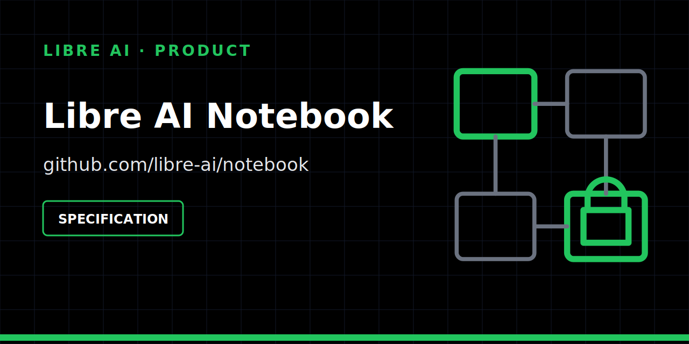

> [!WARNING]
> **Frozen on 2026-07-16 — reserved as the future home of Notebook ([monorepo ADR-0008](https://github.com/libre-ai/libre-ai/blob/main/docs/adr/0008-multi-repo-target-topology-and-brand.md)).**
> Notebook is being rebuilt from locked contracts in the canonical base repository [`libre-ai/libre-ai`](https://github.com/libre-ai/libre-ai) (target: `apps/notebook`). This repository will reopen as the real product repository when the owner activates it. Everything below describes the pre-freeze state and no longer reflects the current architecture or roadmap.

  

# Libre AI Notebook

A private-by-default, local-first knowledge workspace designed for controlled context export.

## Status

| | |
| --- | --- |
| Maturity | **Specification** |
| Works today | product boundary, contribution roadmap and security policy |
| Not available | there is no capture, editor, sync or export runtime |
| Historical ID | `rumble-note` may remain in historical references only |

This repository documents intent. It is not a usable notes application today.

See the [product readiness cockpit](docs/product-readiness.md) for the canonical local snapshot of what is proven, partial, blocked, and later.

## Product boundary

Notebook is intended to own:

- block-based capture, editing, references and backlinks;
- personal local-first organization and retrieval;
- private-by-default context selection;
- explicit, auditable export to other workflows.

It does **not** own generic extraction, orchestration, shared client infrastructure or long-term memory internals. A future `NoteContextExport` must disclose exactly what leaves the private workspace and require explicit user control.

## Next evidence

The next milestone is a minimal block model plus fixture-backed `NoteContextExport` privacy checks. Sync, hosted use and multi-device claims remain out of scope until encryption, conflict and authorization boundaries are proven.

## Contributing

Start with:

- [Roadmap](ROADMAP.md)
- [Contribution guide](CONTRIBUTING.md)
- [Security policy](SECURITY.md)

Contributions should preserve data minimization, local-first operation and reversible handoffs.

## License

[MIT](LICENSE).
